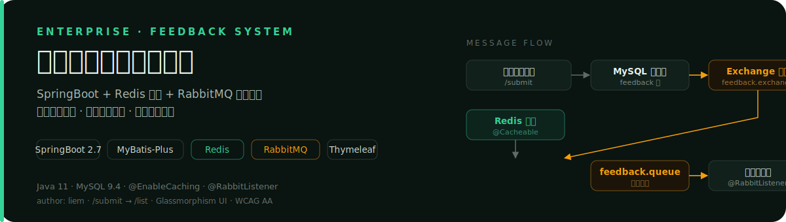
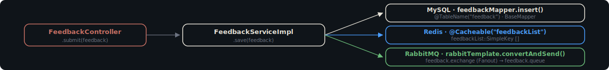

<p align="center">
  
</p>

## Proof · 三链路并行证据

一次 `POST /submit`,在 `FeedbackServiceImpl.save` 内并行触发三条链路。下方示意图为代码级证据,所有类名、方法名、缓存键、交换器与队列名均与源码一致。

<p align="center">
  
</p>

### 真实类名表

| 链路 | 类 / 配置 | 关键代码 |
| --- | --- | --- |
| 持久化 | `Feedback` `FeedbackMapper` `FeedbackServiceImpl` | `@TableName("feedback")` `@TableId` `@TableField` / `extends BaseMapper<Feedback>` |
| 缓存 | `FinalExamApplication` `RedisConfig` `FeedbackController` | `@EnableCaching` / `Jackson2JsonRedisSerializer` / `@Cacheable("feedbackList")` |
| 消息 | `RabbitMQConfig` `FeedbackNoticeConsumer` | `feedback.exchange` (Fanout) + `feedback.queue` 绑定 / `@RabbitListener` |

### 运行时证据(缓存键 / 交换器 / 队列名)

- 缓存键:`feedbackList::SimpleKey []`(空参 SimpleKey,首次查库后写入 Redis)
- 交换器:`feedback.exchange`(Fanout 类型,广播到所有绑定队列)
- 队列:`feedback.queue`(由 `RabbitMQConfig` 声明并与交换器绑定)
- 消费者:`FeedbackNoticeConsumer` 通过 `@RabbitListener` 监听,收到消息后在控制台打印

## What it is

企业内部反馈系统:员工通过 `/submit` 提交意见,管理员通过 `/list` 查看全部意见。一次提交并行触发 MySQL 持久化、Redis 缓存、RabbitMQ 异步通知三条链路。

## Why different

不是单库 CRUD。`POST /submit` 在一次请求内完成三件事,分别由独立组件承担:

- **MySQL 持久化** — `Feedback` 实体映射 `feedback` 表,`FeedbackMapper extends BaseMapper` 完成单表 CRUD,`feedbackMapper.insert(feedback)` 落库
- **Redis 缓存** — `/list` 接口标注 `@Cacheable("feedbackList")`,首次查库后写 Redis,第二次访问直接命中缓存,不再执行 SQL
- **RabbitMQ 消息** — 保存后 `RabbitTemplate` 把 JSON 消息发往 `feedback.exchange`(Fanout),`@RabbitListener` 监听 `feedback.queue` 异步消费,在控制台打印通知

三条链路并行,互不阻塞:用户提交即时返回,缓存命中率可观测,通知消费解耦。

## How it works

```
POST /submit (FeedbackController.submit)
  └─ FeedbackServiceImpl.save(feedback)
       ├─ feedbackMapper.insert(feedback)              // MySQL 持久化
       ├─ (后续 GET /list 首次访问)
       │    └─ @Cacheable("feedbackList") 未命中 → 查库 → 写 Redis
       │                                          (键 feedbackList::SimpleKey [])
       └─ rabbitTemplate.convertAndSend(...)           // RabbitMQ Fanout
            └─ feedback.exchange → feedback.queue
                 └─ FeedbackNoticeConsumer.@RabbitListener  // 控制台打印通知
```

- `GET /list` 标注 `@Cacheable("feedbackList")`:首次查库并写入 Redis,后续请求命中缓存,日志中不再出现 `Preparing: SELECT`
- `RabbitMQConfig` 显式声明 `feedback.exchange`(Fanout)+ `feedback.queue` 并完成绑定,确保交换器与队列在启动时自动创建
- `FeedbackNoticeConsumer` 使用 `@RabbitListener` 监听 `feedback.queue`,消费时反序列化 JSON 并在控制台输出
- 视图层使用 Thymeleaf:`th:action` / `th:object` / `th:field` 渲染表单,`th:each` 遍历列表,玻璃化 UI + SVG 图标 + 响应式布局

## How to use

### 环境要求

- JDK 11+
- Maven 3.6+
- MySQL 8.0+(开发环境使用 9.4.0)
- Redis(任意稳定版本)
- RabbitMQ(任意稳定版本)

### 建库建表

执行仓库内的 `sql/init.sql`:

```sql
CREATE DATABASE IF NOT EXISTS feedback_db DEFAULT CHARSET utf8mb4;
USE feedback_db;
-- feedback 表结构与初始化数据见 sql/init.sql
```

### 修改配置

编辑 `src/main/resources/application.properties`:

```properties
# MySQL
spring.datasource.url=jdbc:mysql://localhost:3306/feedback_db?useSSL=false&serverTimezone=Asia/Shanghai
spring.datasource.username=root
spring.datasource.password=你的密码

# Redis
spring.redis.host=localhost
spring.redis.port=6379

# RabbitMQ
spring.rabbitmq.host=localhost
spring.rabbitmq.port=5672
spring.rabbitmq.username=guest
spring.rabbitmq.password=guest
```

### 启动

```bash
mvn spring-boot:run
```

访问:

- 提交意见:`http://localhost:8080/submit`
- 查看列表:`http://localhost:8080/list`

## 缓存与消息验证

### Redis 缓存命中验证

1. 首次访问 `GET /list`:控制台日志可见 MyBatis 执行 SQL(`Preparing: SELECT ...`),随后 Redis 写入键 `feedbackList::SimpleKey []`
2. 第二次访问 `GET /list`:日志中不再出现 SQL,直接从 Redis 读取,响应显著加快

### RabbitMQ 消息验证

提交一条意见后,控制台立即输出 `FeedbackNoticeConsumer` 收到的消息(JSON 内容,含意见字段),证明 Fanout 交换器与队列绑定生效、异步消费链路打通。

## 测试数据

`sql/init.sql` 内置 3 条 liem 的意见数据,启动后可直接在 `/list` 页面看到,无需手动构造。

---

作者:**liem** · Spring Boot 2.7.18 · MyBatis-Plus 3.5.5 · Java 11
所有前端页面底部显示"作者:liem",数据库与日志中含 liem 标识。
